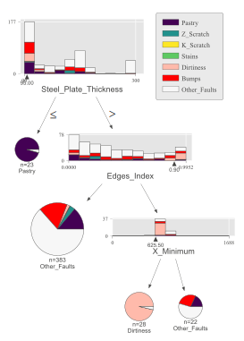

# MoDT: Mixture of Decision Trees
An interpretable DT ensemble method based on the Mixture of Experts architecture. The implementation is inspired by a similar approach called Mixture of Expert Trees: https://arxiv.org/abs/1906.06717 .

The Expectation-Maximization (EM) training algorithm iteratively optimizes a set of decison trees and associated regions:\

Decision area of the final gating function:\

Resulting decision trees:
| DT0 red region | DT1 green region  | DT2 blue region |
| ------------- | ------------- | ------------- |
|   |   |   |

## A more sophisticated example
MoDT is used with the steel plates faults dataset: https://archive.ics.uci.edu/ml/datasets/Steel+Plates+Faults

The visualizations are created with dtreeviz: https://github.com/parrt/dtreeviz

### DT 0 (red):

### DT 1 (green):

### DT 2 (blue):

